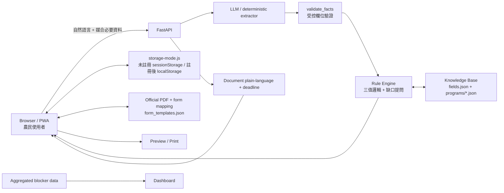

# 農民補給站

> 說一句話找到可能適合的補助，接著一路走到「真的能送件」。

農民補給站是給台灣農民的 AI 補助申請助手。用一句話說出你的狀況，就能找到可能適合的補助、
知道還缺什麼，並把申請拆成一步步的待辦。有官方表單的項目可直接預填列印。
免註冊就能用，個資只留在自己的裝置。

農會、公所與其他協作者則可查看聚合卡點資料並維護補助內容。

本作品參加 **BUILDMODE GEN-AI HACKATHON 2026**。

## Why

台灣農業補助資訊分散在公告、PDF、公文與各受理單位流程中。
農民真正遇到的摩擦不只在「找不到補助」，而是：

- 不知道自己是否符合資格，也不知道還缺哪些資訊。
- 公告、公文與行政用語難讀，期限容易看錯。
- 找到計畫後，仍要自己理解申請順序、準備文件與填表。
- 表單常包含姓名、身分證、電話、地址、銀行帳號、地號等敏感資料，
  不應為了 AI 媒合全部送上伺服器。
- **註冊本身就是一道門檻。** 最需要幫助的人，往往在註冊頁就離開了。

## What it does

完整流程：

**自然語言描述需求 → 補問必要資訊 → 推薦補助與理由 → 補助詳情 → 開始申請 →
任務清單 → 官方表單預填 → Preview / Print → 回到「正在申請」繼續**

### 核心功能

1. **自然語言找補助**
   - 使用者用日常語言描述所在地、作物、設備需求或困難。
   - LLM 只負責把文字抽成受控欄位。
   - 未註冊或不合法的欄位會被驗證層丟棄。

2. **可追溯的規則判定**
   - LLM 不直接決定資格。
   - 規則引擎輸出「符合／可能符合／不符合」，每條結果附法條依據。
   - 缺少關鍵資訊時，只補問真正影響判定的欄位。
   - 補助資料以 JSON 掛載，新計畫可資料驅動加入。

3. **從找到補助到完成申請**
   - 從補助詳情直接按「開始申請」。
   - 系統把行政流程拆成 task checklist。
   - 一般步驟可標記「已完成」；送件型可標記「已送出」；
     文件型則可同時追蹤「已填寫」與「已送出」。
   - 「正在申請」保留進度，離開後可以回來繼續。

4. **官方表單預填**
   - 使用官方 PDF 原版面，不重新畫一張仿政府表單。
   - **欄位在 PDF 旁邊依「這筆資料存在哪裡」分組編輯，PDF 上疊的是唯讀文字。**
     分組不只是版面：它決定了值會被寫去哪裡，畫面上的分法就是實際的儲存行為。
   - 目前已匯入三張官方表單（見 [`data/form_templates.json`](data/form_templates.json)）：

     | 計畫 | 表單 |
     |---|---|
     | 115年省工高效及碳匯農機補助 | 附表9　省工農業機械／新研發農機補助申請書 |
     | 115年省工高效及碳匯農機補助 | 附表16　汰舊燃油農機換購電動農機補助申請書 |
     | 農業天然災害現金救助 | 附件1　農業天然災害受災證明書 |

   - 座標取自 PDF 的表格線，不是目測。只疊「申請人填寫」的部分；
     「調查人員填寫」欄位一格都不碰。

5. **免註冊可用，註冊只換到「不用重填」**
   - 不註冊也能查補助、預填申請表、列印，功能一項不少。
   - 未註冊時資料存在 `sessionStorage`：**關掉分頁就沒了，硬碟上不留東西。**
   - 註冊後改用 `localStorage`，並把這一趟填的東西搬過去；登出時搬回來。
     切換邏輯集中在 [`web/storage-mode.js`](web/storage-mode.js)。

6. **Privacy by design**
   - `MatchingProfile`（作物、鄉鎮、面積、土地權屬）較粗粒度，可同步到帳號。
   - `PrivateFormProfile`（姓名、身分證、電話、完整地址、銀行帳號、
     地段、地號、持分、簽名）**只留在瀏覽器，永遠不上傳**。
   - 後端以欄位名黑名單（[`schemas.py`](src/aidstation/schemas.py) 的
     `PRIVATE_PROFILE_KEYS`）直接拒收，換個欄位名也繞不過去。
   - 官方表單預填、編輯、Preview / Print 全在瀏覽器端完成。

7. **公文白話化與期限**
   - 把公文整理成較容易理解的資訊。
   - 公告型期限直接計算；「收到公文後 N 日」會先問收文日再推算，並顯示計算式。
   - 無法可靠解析時導向承辦電話，不猜測。

8. **卡點儀表板**
   - 以聚合視角呈現申請流程常見卡點，讓服務提供者看見制度摩擦。

## Architecture

Backend 是 `src/aidstation/` 的 FastAPI package，Render 以 `aidstation.api:app` 啟動；
`web/` 是掛載在 `/app/` 的靜態前端，`data/` 提供補助、欄位與官方表單資料。
表單預填與申請進度都在瀏覽器端執行。



### 關鍵設計

- **LLM 不做資格判定**：AI 負責語意抽取，規則引擎負責判定。
- **敏感資料與媒合資料分流**：能留在使用者裝置的個資，不為了 AI 功能送出。
- **官方表單原版面**：預填疊加在官方 PDF 上，不自行偽造政府表單。
- **註冊不是進門的條件**：先讓人用得到，再談要不要留下資料。
- **失敗可降級**：沒有 API key、模型逾時或失敗時，走 deterministic / keyword fallback。

## Repository Structure

```text
farmer/
├── README.md / LICENSE / THIRD_PARTY_NOTICES.md
├── requirements.txt / render.yaml / .env.example
├── run.py                  本機啟動入口
├── src/aidstation/         FastAPI backend
├── web/                    靜態前端、申請流程與表單編輯
├── data/                   補助、欄位與表單資料
├── docs/                   架構、Demo、開發與 hackathon 文件
├── tests/                  backend、API 與流程測試（175 項）
└── scripts/                demo、seed 與維運 helper
```

主要程式與資料位置：

```text
src/aidstation/
  api.py              FastAPI endpoints
  extract.py          語意抽取 + validate_facts
  engine.py           三值邏輯規則引擎
  matching.py         補助媒合與推薦卡
  fields.py           欄位字典與正規化
  knowledge.py        補助知識庫（程式／方案／梯次階層）
  schemas.py          共用契約，含個資欄位黑名單
  deadline.py         期限計算（工作日接國定假日）
  document.py         公文白話化
  flow.py             對話狀態機
  official_forms.py   官方表單 manifest / mapping
  auth.py             帳號與統一登入
  members.py          會員資料（只存 MatchingProfile）
  line_login.py       LINE Login
  line_webhook.py     LINE webhook
  demo_seed.py        示範帳號（設了 DEMO_PASSWORD 才啟用）
  blockers.py         卡點資料
  admin.py            管理功能

web/
  profile.html        我的資料（免登入可用）
  form.html           申請表單頁
  program.html        補助詳情與「開始申請」
  applications.html   正在申請
  storage-mode.js     未註冊／註冊的儲存區切換
  profile-store.js    PrivateFormProfile（只在瀏覽器）
  application-store.js 申請進度
  form-prefill.js     官方表單預填與疊字
  official-forms/     checked-in PDF 與預覽圖

data/
  fields.json         欄位字典（含台語別名：檨仔→芒果）
  programs/           補助資料（10 項）
  form_templates.json 官方表單 manifest 與欄位座標
  holidays.json       國定假日

scripts/
  seed_demo_farmer.py 建立示範農民帳號
  demo.py             終端機互動展示
```

## Quick Start

```bash
python -m venv venv
source venv/bin/activate          # Windows: venv\Scripts\Activate.ps1
pip install -r requirements.txt
python run.py
```

開啟 <http://127.0.0.1:8000/app/>

固定 Demo 日期（避免示範公告過期而顯示為關閉）：

```bash
DEMO_MODE=true DEMO_DATE=2026-08-20 python run.py
```

### 跑測試

```bash
python -m pytest tests/ -q
```

### 環境變數

| 變數 | 用途 | 未設定時 |
|------|------|---------|
| `ANTHROPIC_API_KEY` | 語意抽取與公文翻譯走 Claude | 降級為關鍵字／規則式，離線可跑 |
| `ADMIN_PASSWORD` | 後台帳號 | 不建立後台帳號 |
| `MEMBER_SECRET` / `ADMIN_SECRET` | 登入 cookie 簽章 | 每次啟動隨機產生（重啟即登出） |
| `DEMO_PASSWORD` | 啟動時重建示範農民帳號 | 不建立，正式站請留空 |
| `LINE_CHANNEL_SECRET` / `LINE_CHANNEL_ACCESS_TOKEN` | LINE webhook | dry-run |

部署步驟見 [`docs/deployment.md`](docs/deployment.md)；
Windows 本機開發見 [`docs/local-development.md`](docs/local-development.md)。

## Data Sources

- `data/programs/*.json`：Demo 使用的補助與申請流程資料。
- `data/fields.json`：語意抽取、正規化與規則判定共用的欄位字典。
- `data/form_templates.json`：官方表單 manifest，描述欄位座標與預填來源。
- `web/official-forms/`：隨 repo 提供的官方 PDF 與預覽圖。
- `data/guides.json`、`data/holidays.json`、`data/disaster_stats.json`：
  指南、期限計算與展示統計資料。

⚠️ **`data/programs/` 十項全部是示範資料，不可用於真實申辦指引。**
`source.status` 分兩種，都不是現行公告：

| status | 幾項 | 意思 |
|---|---|---|
| `official_demo_fixture` | 5 | 依官方公告整理，但已簡化（`demo_simplified: true`），且附官方連結 |
| `sample` | 5 | 完全編造的示範資料 |

正式上線需要真實公告匯入與人工覆核流程。

第三方素材的來源與權利說明見 [`THIRD_PARTY_NOTICES.md`](THIRD_PARTY_NOTICES.md)。

## Known Gaps

誠實列出目前**還沒做到**的事：

- **LINE 推播尚未實作。** 介面上寫著「有相關補助時會用 LINE 通知你」，
  但目前只有 LINE Login；`line_login.py` 把 userId 雜湊成代號後就沒有保留，
  沒有可推播的對象。上線前必須補上訂閱表與推播排程，或先移除該文案。
- **OCR 未接入。** 公文白話化目前吃文字，拍照上傳的辨識尚未串接。
- **補助資料為示範資料**，需要真實公告匯入與人工覆核流程。

## Privacy

`MatchingProfile` 只送出補助媒合需要的概略資料。
姓名、身分證、電話、完整地址、銀行帳號、地段、地號、持分、簽名等
`PrivateFormProfile` 只留在瀏覽器；未註冊時連瀏覽器都只留在 `sessionStorage`，
關掉分頁即消失。官方表單預填、編輯、Preview / Print 都在瀏覽器端完成。

**Demo 請只使用編造的資料。**

## License

本專案自有程式碼採用 [MIT License](./LICENSE)。

政府表單、官方文件、資料、商標及其他第三方素材不因收錄於本 repository
而改變原始授權或權利歸屬；詳見 [`THIRD_PARTY_NOTICES.md`](./THIRD_PARTY_NOTICES.md)。
