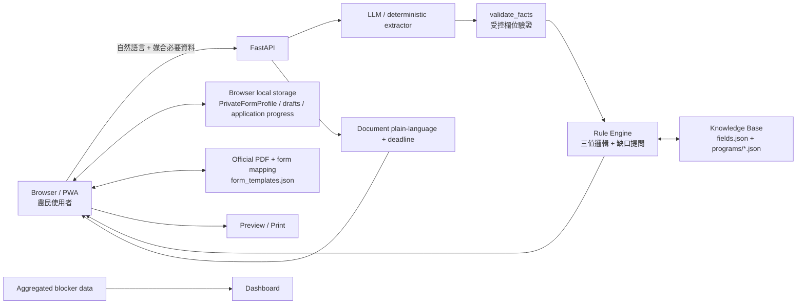

# 農民補給站

> 說一句話找到可能適合的補助，接著一路走到「真的能送件」。

農民補給站是一個面向台灣農民的 AI 補助申請助手。它不只做「推薦補助」：
系統會把自然語言需求轉成受控欄位，由規則引擎判定資格與缺口，再把申請拆成待辦；
對已有官方紙本表單的計畫，使用者可以直接在官方 PDF 版面上預填、修改並列印。
主要使用者是台灣農民；農會、公所與其他協作者則可查看聚合卡點資料並維護補助內容。

本作品參加 **BUILDMODE GEN-AI HACKATHON 2026**。

## Why

台灣農業補助資訊分散在公告、PDF、公文與各受理單位流程中。
農民真正遇到的摩擦不只在「找不到補助」，而是：

- 不知道自己是否符合資格，也不知道還缺哪些資訊。
- 公告、公文與行政用語難讀，期限容易看錯。
- 找到計畫後，仍要自己理解申請順序、準備文件與填表。
- 表單常包含姓名、身分證、電話、地址、銀行帳號等敏感資料，不應為了 AI 媒合全部送上伺服器。

## What it does

完整流程：

**自然語言描述需求 → 補問必要資訊 → 推薦補助與理由 → 補助詳情 → 開始申請 → 任務清單 → 官方表單預填／直接修改 → Preview / Print → 回到「正在申請」繼續**

### 核心功能

1. **自然語言找補助**
   - 使用者用日常語言描述所在地、作物、設備需求或困難。
   - LLM 只負責把文字抽成受控欄位。
   - 未註冊或不合法欄位會被驗證層丟棄。

2. **可追溯的規則判定**
   - LLM 不直接決定資格。
   - 規則引擎輸出「符合／可能符合／不符合」。
   - 缺少關鍵資訊時，只補問真正影響判定的欄位。
   - 補助資料以 JSON 掛載，新計畫可資料驅動加入。

3. **從找到補助到完成申請**
   - 從補助詳情直接按「開始申請」。
   - 系統把行政流程拆成 task checklist。
   - 一般步驟可標記「已完成」；送件型可標記「已送出」；
     文件型則可同時追蹤「已填寫」與「已送出」。
   - 「正在申請」保留進度，離開後可以回來繼續。

4. **官方 PDF 表單預填與直接編輯**
   - Demo 使用官方 PDF 原版面，不重新畫一張仿政府表單。
   - `data/form_templates.json` 與表單 mapping 定義可編輯欄位座標。
   - 使用者可直接在原表單畫面修改欄位，再 Preview / Print。

5. **Privacy by design**
   - `MatchingProfile` 只包含補助媒合必要、較粗粒度資訊。
   - `PrivateFormProfile`（姓名、身分證、電話、完整地址、銀行帳號、地號、簽名等）
     留在瀏覽器端。
   - 表單草稿與申請進度保存於 browser local storage。
   - 私密表單資料不需要為了補助媒合送到後端。

6. **公文白話化與期限**
   - 把公文整理成較容易理解的資訊。
   - 公告型期限直接計算；「收到公文後 N 日」會先取得收文日再推算。
   - 無法可靠解析時不猜測。

7. **卡點儀表板**
   - 以聚合視角呈現申請流程常見卡點，讓服務提供者看見制度摩擦。


## Architecture

目前部署的主要 backend 是 `src/aidstation/` 裡的 FastAPI package，Render 以
`aidstation.api:app` 啟動；`web/` 是由 FastAPI 掛載在 `/app/` 的靜態前端，`data/`
則提供補助、欄位與官方表單資料。官方表單的欄位編輯與預填主要在
`web/form-prefill.js`、`web/profile.html` 的 browser 端執行，不再依賴獨立的舊版預填服務。



### 關鍵設計

- **LLM 不做資格判定**：AI 負責語意抽取，規則引擎負責判定。
- **敏感資料與媒合資料分流**：能留在使用者裝置的個資，不為了 AI 功能送出。
- **官方表單原版面**：預填功能疊加在官方 PDF 上，不自行偽造政府表單。
- **失敗可降級**：沒有 API key、模型逾時或失敗時，可走 deterministic / keyword fallback。

## Demo

本機 Demo 從自然語言找補助開始，會一路走到補助詳情、申請 checklist、官方表單預填與 Preview / Print。
完整的 Hero persona、驗收步驟與已知取捨請看 [`docs/demo.md`](docs/demo.md)。

## Repository Structure

第一次進 repo 時，可以先從下面幾個目錄定位 backend、frontend、資料與文件：

```text
farmer/
├── README.md
├── LICENSE
├── THIRD_PARTY_NOTICES.md
├── .env.example
├── .gitignore
├── requirements.txt
├── render.yaml
├── run.py                  本機啟動入口
├── src/aidstation/         FastAPI backend
├── web/                    靜態前端、申請流程與表單編輯
├── data/                   補助、欄位與表單資料
├── docs/                   架構、Demo、開發與 hackathon 文件
├── tests/                  backend、API 與流程測試
└── scripts/                demo、seed 與維運 helper
```

主要程式與資料位置：

```text
src/aidstation/
  api.py              FastAPI endpoints
  extract.py          語意抽取 + validate_facts
  engine.py           三值邏輯規則引擎
  fields.py           欄位字典與正規化
  knowledge.py        補助知識庫
  deadline.py         期限計算
  document.py         公文白話化
  flow.py             對話狀態機
  official_forms.py   官方表單 manifest / mapping
  blockers.py         卡點資料
  admin.py            管理功能
  line_webhook.py     LINE webhook

data/
  fields.json
  programs/
  form_templates.json
  官方表單 template manifest

web/
  profile.html        MatchingProfile / PrivateFormProfile
  form-prefill.js     browser-side official PDF prefill
  official-forms/     checked-in PDF 與預覽素材

docs/
  architecture.md     backend、資料與主要流程
  demo.md             Hero Demo 與驗收步驟
  design.md           介面設計原則
  deployment.md       Render 部署
  local-development.md 本機開發與展示
  hackathon/          展示腳本與互動說明
```

## Quick Start

### 建立環境

```bash
python -m venv venv
source venv/bin/activate
pip install -r requirements.txt
```

Windows PowerShell：

```powershell
venv\Scripts\Activate.ps1
```

### 啟動 Demo

```bash
DEMO_MODE=true DEMO_DATE=2026-08-20 PORT=8000 python run.py
```

開啟：

```text
http://127.0.0.1:8000/app/?demo=1
```

`DEMO_DATE=2026-08-20` 是 Demo 用固定日期，避免正式受理日期已過時讓計畫顯示為關閉。

### 啟動 API

```bash
python -m uvicorn aidstation.api:app --reload --app-dir src
```

Render 使用 [`render.yaml`](render.yaml) 中的同一個 app path 與 start command：

```bash
python -m uvicorn aidstation.api:app --host 0.0.0.0 --port $PORT --app-dir src
```

部署步驟請看 [`docs/deployment.md`](docs/deployment.md)；Windows 本機開發可看
[`docs/local-development.md`](docs/local-development.md)。

### 跑測試

```bash
python -m pytest tests/ -q
python -m py_compile src/aidstation/*.py
```

## Data Sources

- `data/programs/*.json`：目前 Demo 使用的補助與申請流程資料。
- `data/fields.json`：語意抽取、正規化與規則判定共用的欄位字典。
- `data/form_templates.json`：官方表單 template manifest，描述欄位 mapping 與預填來源。
- `web/official-forms/`：隨 repo 提供的官方 PDF 與預覽素材；前端使用 manifest 進行預填。
- `data/guides.json`、`data/holidays.json` 與 `data/disaster_stats.json`：指南、期限計算與展示統計資料。

官方文件、政府資料、字型與其他第三方素材的來源及權利說明，集中在
[`THIRD_PARTY_NOTICES.md`](THIRD_PARTY_NOTICES.md)。

## Privacy

`MatchingProfile` 只送出補助媒合需要的概略資料。姓名、身分證、電話、完整地址、
銀行帳號、地號、簽名等 `PrivateFormProfile` 留在 local browser；表單欄位、草稿與申請進度
也由 browser local storage 保存。官方表單預填、編輯、Preview / Print 都在瀏覽器端完成，
Demo 請只使用編造的資料。

## License

本專案自有程式碼採用 [MIT License](./LICENSE)。

政府表單、官方文件、資料、商標及其他第三方素材不因收錄於本 repository 而改變原始授權或權利歸屬；詳見 [`THIRD_PARTY_NOTICES.md`](./THIRD_PARTY_NOTICES.md)。
