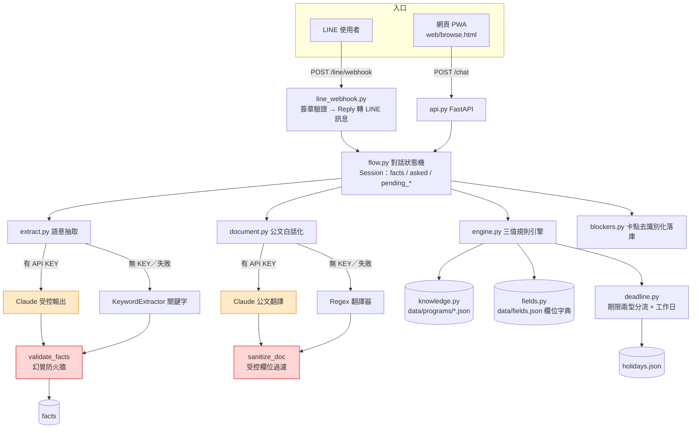
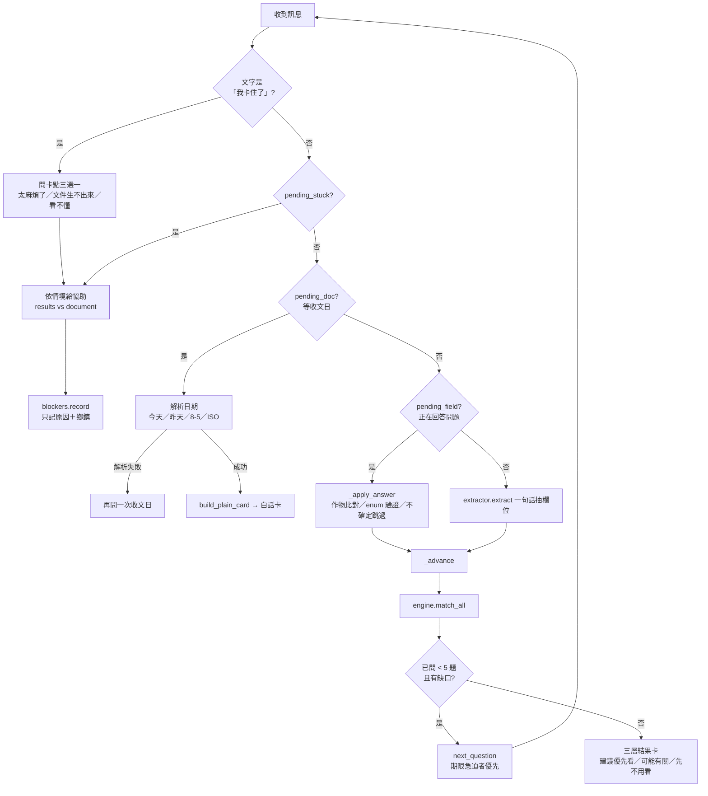
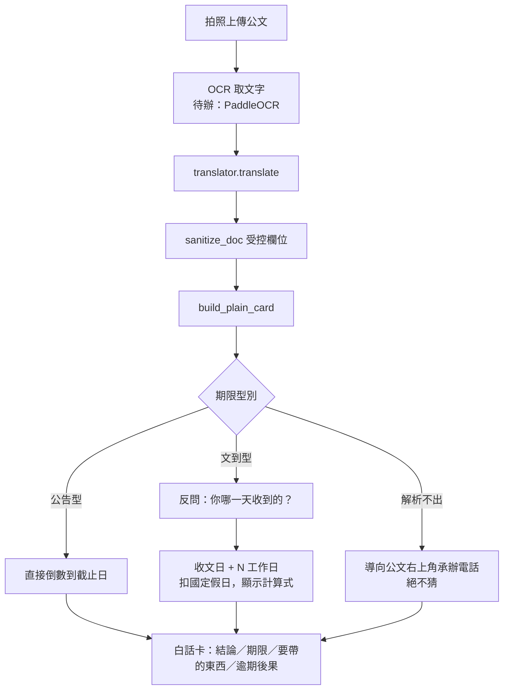
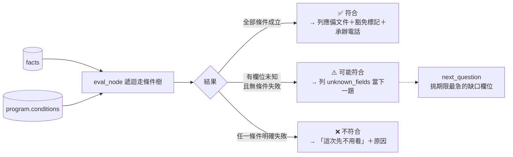

# 系統流程圖

## 1. 總覽（架構）

```mermaid
flowchart TB
    subgraph 入口
        LINE[LINE 使用者]
        PWA[網頁 PWA<br/>web/browse.html]
    end

    LINE -->|POST /line/webhook| WH[line_webhook.py<br/>簽章驗證 → Reply 轉 LINE 訊息]
    PWA -->|POST /chat| API[api.py FastAPI]
    WH --> FLOW
    API --> FLOW[flow.py 對話狀態機<br/>Session：facts / asked / pending_*]

    FLOW --> EXT[extract.py 語意抽取]
    FLOW --> DOC[document.py 公文白話化]
    FLOW --> ENG[engine.py 三值規則引擎]
    FLOW --> BLK[blockers.py 卡點去識別化落庫]

    EXT -->|有 API KEY| CLAUDE1[Claude 受控輸出]
    EXT -->|無 KEY／失敗| KW[KeywordExtractor 關鍵字]
    CLAUDE1 --> VF[validate_facts<br/>幻覺防火牆]
    KW --> VF
    VF --> FACTS[(facts)]

    DOC -->|有 API KEY| CLAUDE2[Claude 公文翻譯]
    DOC -->|無 KEY／失敗| RE[Regex 翻譯器]
    CLAUDE2 --> SAN[sanitize_doc<br/>受控欄位過濾]
    RE --> SAN

    ENG --> KB[(knowledge.py<br/>data/programs/*.json)]
    ENG --> FLD[(fields.py<br/>data/fields.json 欄位字典)]
    ENG --> DL[deadline.py<br/>期限兩型分流 + 工作日]
    DL --> HOL[(holidays.json)]

    classDef llm fill:#ffe9c7,stroke:#d08700
    classDef guard fill:#ffd6d6,stroke:#c00
    class CLAUDE1,CLAUDE2 llm
    class VF,SAN guard
```

> 紅色為安全閘：LLM 只能提供欄位值，**資格判定永遠只發生在 engine.py**。

## 2. 對話流程（flow.py 狀態機）

```mermaid
flowchart TD
    IN[收到訊息] --> STUCK{文字是<br/>「我卡住了」?}
    STUCK -->|是| ASKWHY[問卡點三選一<br/>太麻煩了／文件生不出來／看不懂]
    ASKWHY --> HELP[依情境給協助<br/>results vs document]
    HELP --> REC[blockers.record<br/>只記原因＋鄉鎮]

    STUCK -->|否| PS{pending_stuck?}
    PS -->|是| HELP
    PS -->|否| PD{pending_doc?<br/>等收文日}
    PD -->|是| DATE[解析日期<br/>今天／昨天／8-5／ISO]
    DATE -->|解析失敗| REASK[再問一次收文日]
    DATE -->|成功| CARD[build_plain_card → 白話卡]

    PD -->|否| PF{pending_field?<br/>正在回答問題}
    PF -->|是| APPLY[_apply_answer<br/>作物比對／enum 驗證／不確定跳過]
    PF -->|否| EX[extractor.extract 一句話抽欄位]

    APPLY --> ADV
    EX --> ADV[_advance]
    ADV --> MATCH[engine.match_all]
    MATCH --> Q{已問 &lt; 5 題<br/>且有缺口?}
    Q -->|是| NEXTQ[next_question<br/>期限急迫者優先] --> IN
    Q -->|否| RESULT[三層結果卡<br/>建議優先看／可能有關／先不用看]
```

## 3. 公文流程與期限分流

```mermaid
flowchart TD
    PHOTO[拍照上傳公文] --> OCR[OCR 取文字<br/>待辦：PaddleOCR]
    OCR --> TR[translator.translate]
    TR --> SAN[sanitize_doc 受控欄位]
    SAN --> CD[build_plain_card]
    CD --> TYPE{期限型別}
    TYPE -->|公告型| CNT[直接倒數到截止日]
    TYPE -->|文到型| ASK[反問：你哪一天收到的？]
    ASK --> CALC[收文日 + N 工作日<br/>扣國定假日，顯示計算式]
    TYPE -->|解析不出| TEL[導向公文右上角承辦電話<br/>絕不猜]
    CNT --> OUT[白話卡：結論／期限／要帶的東西／逾期後果]
    CALC --> OUT
    TEL --> OUT
```

## 4. 三值邏輯判定（engine.py）

```mermaid
flowchart LR
    F[(facts)] --> EV[eval_node 遞迴走條件樹]
    P[(program.conditions)] --> EV
    EV --> R{結果}
    R -->|全部條件成立| Y[✅ 符合<br/>→ 列應備文件＋豁免標記＋承辦電話]
    R -->|有欄位未知<br/>且無條件失敗| M[⚠️ 可能符合<br/>→ 列 unknown_fields 當下一題]
    M -.-> NQ[next_question<br/>挑期限最急的缺口欄位]
    R -->|任一條件明確失敗| N[❌ 不符合<br/>→ 「這次先不用看」＋原因]
```
