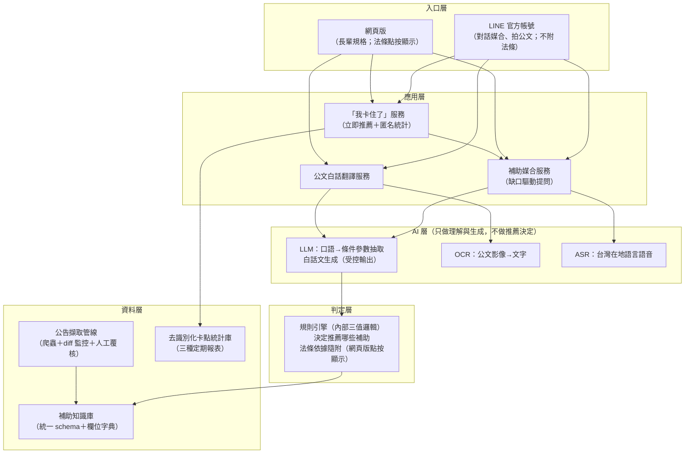
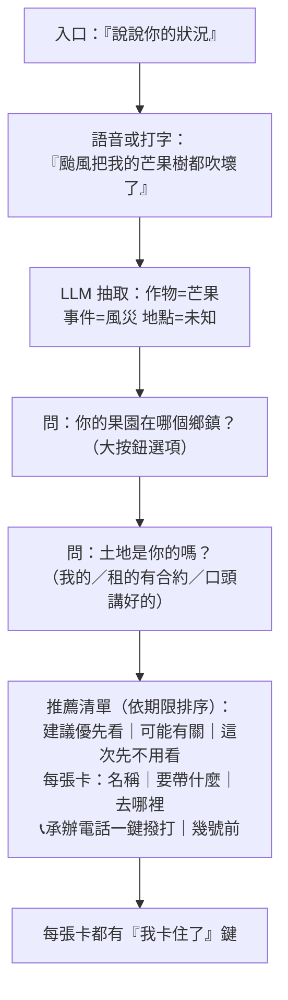

# 農民補給站 系統設計建議書

依據《提案計劃書》、黑客松表單回覆與 2026-08-13 功能架構定案改寫。目標：讓系統在 3 個月實作期內真的做得出來，且對 64 歲的農民真的好用。

**本版原則：系統功能大項只有三項（補助媒合、公文白話翻譯、「我卡住了」回饋迴路），所有設計與對外文件以此為準。** 原提案的災前健檢、公告推播、協辦者工作台等移至第十一節「未來擴充」，不屬本版功能。

---

## 一、功能架構定案（2026-08-13 使用者確認）

### 功能一：補助媒合

- 1.1 農民用台灣在地語言或中文描述困境（例：颱風把我的芒果樹都吹壞了）
- 1.2 系統從口語中理解關鍵資訊（作物、災害事件等）
- 1.3 自動媒合合適的補助資源並推薦給農民
- 1.4 資訊不足時缺口驅動追問，一次一題
- 1.5 法條依據僅網頁版提供，且採點按才顯示，不主動顯示（LINE 版不附法條）
- 1.6 每筆推薦附實務提醒：要準備哪些申請文件、去哪申請、承辦人電話、截止期限

### 功能二：公文白話翻譯

- 2.1 收到政府公文後，拍照上傳
- 2.2 系統自動將艱澀公文翻譯成白話文，讓長輩看得懂

### 功能三：「我卡住了」回饋迴路

- 3.1 申請遇到困難（看不懂流程、不知道去哪請領資料、聽不懂承辦人回覆）時按下按鈕
- 3.2 系統立即推薦其它合適的補助
- 3.3 卡點匿名統計，讓政府第一次看到民眾在申請流程哪一步放棄
- 3.4 定期自動產出三種報表：鄉鎮級卡點分布、補助類別卡點統計、「我卡住了」原因排行

### 橫向特性（非功能，寫進技術/安全段落）

- 長輩友善介面（大字大按鈕、一次一題）
- AI 只做理解與翻譯；推薦哪些補助由規則引擎決定（內部三值邏輯不變）
- **對外措辭鐵則：絕不告知使用者「符合資格／會通過」，一律推薦框架，注明以承辦單位認定為準**

### 對外文案兩大獨特性

1. **反向推薦補助**：農民不用自己查，說一句話系統就推薦合適補助＋實務提醒
2. **卡點統計回饋迴路**：「我卡住了」讓政府第一次看見放棄發生在哪一步

---

## 二、系統架構

### 2.1 整體架構



### 2.2 最關鍵的一條資料流：媒合推薦

RAG＋規則引擎混合，兩者的交接面必須釘死，否則實作時一定混掉。正確分工：

```
農民語音「阮的檨仔攏落了了」
  → ASR → 「我的芒果全掉了」
  → LLM 抽取條件參數（受控輸出 JSON）：{作物: 芒果, 事件: 天然災害落果, 地點: 未知, 地權: 未知…}
  → 規則引擎逐案比對知識庫：每個補助的條件樹算出 可能符合／不確定／可能不符合（內部三值）
  → 「未知」欄位驅動下一個提問（挑最能縮小範圍的欄位，一次問一題）
  → 3~5 題內收斂 → 輸出推薦清單＋實務提醒，法條條號與最後查核日隨附（網頁版點按顯示）
```

要點一：**LLM 從頭到尾不決定推薦哪些補助**，它只做兩件事——把口語轉成結構化參數、把規則引擎的結構化結論轉成白話。這樣推薦準確率的查核點才有辦法歸因與改進（錯在抽取？錯在規則？錯在資料過期？可分開量測）。

要點二：**三值邏輯只存在於系統內部**。對使用者的呈現一律是推薦框架：「建議優先看」「可能有關，再回答一題就知道」「這次先不用看」，全站注明「實際資格由承辦單位認定」。絕不出現「符合／不符合」「會通過」等判定字樣——使用者把建議當行政效力是本系統最大的誤導風險。

三值邏輯同時是對話引導的引擎：「未知」不是缺陷，而是下一題從哪來的依據。這讓對話式引導不必寫死問卷腳本，新增補助匯入 schema 後提問自動跟著變——「新增補助不改程式」。

### 2.3 補助知識庫 schema（v0）

```json
{
  "id": "moa-disaster-cash-mango-2026-07",
  "name": "農業天然災害現金救助（芒果）",
  "category": "災害救助",
  "authority": {"level": "中央", "agency": "農糧署", "office": "○○科", "tel": "049-xxxxxxx"},
  "eligibility": {
    "all": [
      {"field": "crop", "op": "in", "value": ["芒果"], "legal_ref": "115農糧字第xxx號公告"},
      {"field": "township", "op": "in", "value": ["玉井區", "南化區"], "legal_ref": "同上"},
      {"field": "loss_rate", "op": ">=", "value": 0.2, "legal_ref": "救助辦法§6"},
      {"any": [
        {"field": "land_tenure", "op": "=", "value": "自有"},
        {"field": "land_doc", "op": "in", "value": ["租約", "使用同意書", "從農工作證明"]},
        {"field": "policy_enrolled_2y", "op": "=", "value": true,
         "note": "豁免條款：近兩年同地參與政策登錄者免附土地文件", "legal_ref": "作業要點§4"}
      ]}
    ]
  },
  "documents": [
    {"name": "土地合法使用證明", "where": "公所農業課", "exempt_if": "policy_enrolled_2y"},
    {"name": "存摺影本", "where": "自備"}
  ],
  "window": {"type": "逐次公告", "open": "2026-07-15", "close_rule": "公告翌日起10個工作日", "close": "2026-07-29"},
  "amount": {"unit": "每公頃", "value": 90000},
  "source": {"url": "…", "announced_at": "2026-07-14", "last_verified": "2026-07-16", "status": "active"}
}
```

`documents`、`authority.tel`、`window` 三個欄位直接餵給 1.6 的實務提醒：要帶什麼、去哪辦、打給誰、幾號前。

配套需要一份**條件欄位字典**（`crop`、`township`、`land_tenure`、`age`、`loss_rate`、`policy_enrolled_2y`…），LLM 抽取與規則引擎共用同一字典，含台語別名正規化（檨仔→芒果）。欄位字典是整個系統的中樞。

---

## 三、功能一設計細節：補助媒合

### 3.1 對話流程



原則：一次一題、每題有按鈕選項（語音是輔助不是唯一路徑）、3~5 題內必出結果。「不確定」的補助顯示為「可能有關——再回答一題就知道」，缺口提問直接嵌在卡片上，不隱藏。每卡附「推薦原因：你說……」歸因，網頁版另提供「法條依據」點按展開（不主動顯示）；LINE 版不附法條。

### 3.2 截止期限提醒（1.6）的兩型分流

推薦卡上的「幾號前」必須算對——算錯期限導致農民逾期，比整個功能不存在更糟，**這是本系統的第一安全原則**。

1. **公告型**：受理起迄日期寫明確（如「受理至 7/29」），直接顯示「幾號前（剩 N 天）」倒數。
2. **文到型**（「文到○日內」類個案期限）：起算日是收文日，系統讀不到。**必須反問「你哪一天收到的？」**再推算，並顯示計算式（7/21 收到＋7 日＝7/28 前）。
3. 期限資訊不確定時不顯示推算結果，改顯示「請向承辦確認」＋一鍵撥號。
4. 工作日 vs 日曆日接假日行事曆計算，並標明用的是哪一種。

### 3.3 台灣在地語言輸入：用現成本土 ASR，不自行微調

- **聯發創新基地 Breeze-ASR**（Whisper 架構、Apache 2.0，台語辨識，支援國台語混講）
- **數位發展部數位產業署 Taiwan Tongues ASR CE**（開源，支援國、台、客、英混合辨識）

真正該投入的是**作物名與農政詞彙的辨識校正**（檨仔→芒果、菜瓜→絲瓜、看無→看不懂）：做一層台語農業詞彙對照表，成本低、效果直接。長輩腔調與田邊噪音需場域實測；語音辨識失敗不卡死流程，按鈕選項永遠並存，辨識結果先覆誦確認再送出。

---

## 四、功能二設計細節：公文白話翻譯

### 4.1 流程

```
拍照上傳 → OCR → LLM 受控抽取（結論、待辦、期限規則、後果）
→ 若期限為文到型：反問「你哪一天收到這張公文？」（今天／昨天／選日期）
→ 白話文輸出：①這張公文在說什麼（一句話）②你要做什麼
   ③幾號前（文到型附計算式）④不辦會怎樣 ⑤去哪裡辦＋📞
→（背景）去識別化卡點分類入庫，影像即刻刪除
```

### 4.2 受控抽取格式

```json
{
  "doc_type": "補正通知",
  "issuer": "○○縣政府農業處",
  "conclusion": "勘查結果與申報不符，需補件說明",
  "todo": [{"item": "災損照片", "where": "自己手機"}],
  "deadline_rule": "文到7日內",
  "deadline_date": null,
  "consequence": "逾期駁回申請",
  "confidence": {"deadline": 0.94, "todo": 0.87}
}
```

任一關鍵欄位（期限、待辦）信心低於門檻 → 該欄位顯示公文原文對照＋「請向承辦確認」＋直撥電話，不顯示推算結果。文案禁用行政用語：「補正」→「補文件」、「檢具」→「帶」、「逾期失權」→「過期就不能領了」。

---

## 五、功能三設計細節：「我卡住了」回饋迴路

### 5.1 農民端：先給幫助

按下「我卡住了」後是**求助頁**，不是問卷：

1. 一題三選項釐清卡點：太麻煩了／文件生不出來／看不懂（依所在情境——推薦結果頁或公文頁——給不同選項組）
2. 依原因給對應協助：**立即推薦其它合適的補助**（3.2）、可協助單位（農會推廣員、公所農業課、村里幹事）與聯絡方式
3. 資料是副產品：卡點去識別化入庫，不記錄身分

「我卡住了」語意較廣（求助＋放棄都會按），由那一題三選項把「放棄」訊號分離出來，資料比單一放棄鍵更精準。

### 5.2 政府端：三種定期報表

定期自動產出（MVP 用靜態報表 PDF＋開放資料 CSV，不做互動 dashboard）：

1. **鄉鎮級卡點分布**（地圖一頁）
2. **補助類別卡點統計**（哪類補助最卡人）
3. **「我卡住了」原因排行**（太麻煩／文件生不出來／看不懂的占比與趨勢）

這是政府第一次能看見「沒送件的人」卡在哪一步——哪份文件該免附、哪份公告該改寫白話、哪個公所需要支援，有數據可依。

---

## 六、對外措辭規範（全系統適用）

| 內部狀態 | 對使用者顯示 |
|----------|-------------|
| 可能符合（條件全過） | 「看起來和你蠻有關的，建議優先處理」 |
| 不確定（有未知欄位） | 「可能有關，再回答一題就知道」／「直接去問承辦會幫你確認」 |
| 可能不符合 | 「這筆可能用不到，不過條件常有例外，打電話問最準」（否定也留出口） |

- 全站固定注明：「實際資格由承辦單位認定」
- 禁用詞：「符合資格」「不符合」「會通過」「成功率」
- 每張推薦卡附「推薦原因：你說……」歸因
- 法條依據：網頁版點按才顯示；LINE 版不附

---

## 七、觸及管道與介面規格

### 7.1 雙前端、一顆引擎

**LINE 官方帳號**（對話媒合、拍公文；不附法條）＋**網頁版**（長輩規格完整版；法條點按顯示），共用同一套對話引擎與後端 API，改一處兩邊生效。

### 7.2 長輩模式規格（可驗收）

| 項目 | 規格 |
|------|------|
| 字級 | 內文 ≥ 20pt，重點（期限、金額）≥ 28pt |
| 觸控目標 | ≥ 48×48px，按鈕間距 ≥ 8px |
| 每頁資訊量 | 一頁一件事：一個問題，或一張推薦卡 |
| 選項形式 | 一律大按鈕；**禁用下拉選單、日期滾輪、多欄表單** |
| 語音 | 每個輸入點都有麥克風鍵；辨識結果先覆誦確認再送出 |
| 電話 | 顯示即可撥（tel: 連結），不要求抄號碼 |
| 期限 | 一律「幾號前（剩 N 天）」雙格式；3 天內轉紅 |
| 文案 | 口語直述，禁用行政用語 |
| 推薦卡資訊優先序 | ① 幾號前 ② 去哪裡 ③ 帶什麼 ④ 打給誰——金額與法條收在展開區 |
| 失敗路徑 | 任何 AI 功能失敗（聽不懂、拍不清）都有人工出口：「打電話問」＋「找人幫你辦」 |

輸出文案也要能用台語唸得順——場域測試時請農戶唸出聲，唸不順的文案就改。

---

## 八、資料維運：把它當成一個功能來做

本系統的競爭對手不是別的系統，是「資料過期」。

```
爬蟲（農業部救助專區、行政院公報、22縣市農業處）每 2~6 小時 diff
  → 偵測新公告 → LLM 抽取為 schema 草稿
  → 人工覆核佇列（維運者確認地區、品項、期限）→ 入庫生效
```

- **人工在迴圈是刻意設計**：錯誤地區或錯誤期限的代價太高，寧可慢 1 小時、不可錯一字。
- 每筆補助 `last_verified` 超過 N 天（災害公告 3 天、常態補助 30 天）自動降級顯示「本資料查核中，申辦前請電洽」，而非下架也非裝作沒事。
- 維運人力在試辦期實測（估 1 縣市每週 2~4 小時），作為擴展 22 縣市的成本依據——這本身就是概念驗證該產出的關鍵數據。

---

## 九、隱私與安全

1. **匿名為原則**：媒合查詢與公文翻譯不強制註冊、不收真實身分；當次對話的條件參數不落地，公文影像處理完即刪。
2. **卡點統計去識別化**：按下「我卡住了」的當下即去識別化，庫裡有卡點、沒有人。
3. **幻覺防火牆**：LLM 只能輸出受控 JSON，validate_facts()／sanitize_doc() 過濾未註冊欄位與非法值——就算模型整個被污染，也改不了推薦結果。
4. **不過度承諾即是安全設計**：系統絕不告訴使用者「你符合資格／會通過」，一律推薦框架＋「以承辦單位認定為準」。對可能憑螢幕上一句話就行動的長輩族群，過度承諾與技術漏洞同等危險。
5. **第一安全原則**：期限算不準就不顯示，導向承辦電話。
6. 金鑰放環境變數不進程式碼；無金鑰時降級為關鍵字抽取，離線可跑，核心功能不需農民資料離開伺服器。
7. **服務線與研究線分離**：使用者上傳的公文即刪；公文樣本標註集只來自場域網絡另行書面同意提供的去識別化樣本，不從服務線撈。

---

## 十、MVP 切分與 Demo 劇本

| 優先 | 範圍 | 對應查核點 |
|------|------|-----------|
| **P0 必做** | 欄位字典＋schema v1；規則引擎（內部三值邏輯）；災害救助＋農民福利兩類 50 項入庫；對話媒合（功能一，含實務提醒與期限兩型）；公文拍照白話化（功能二，含收文日反問）；「我卡住了」求助頁＋卡點入庫（功能三前半） | 推薦準確率 85%、公文欄位擷取 90% |
| **P1 精簡版** | 三種定期報表（靜態 PDF＋CSV＋一頁卡點地圖）；公告監測＋人工覆核（試辦縣市）；台語 ASR 串接 | 場域驗證、卡點首批資料 |
| **P2 延後** | 未來擴充項（見第十一節）、22 縣市全量資料 | 決審後 |

**決審 Demo 劇本**（評審 8 分鐘看什麼）：

1. 長輩手機實機，台語講「阮的檨仔攏落了了」→ 3 題 → 推薦卡＋要帶什麼＋一鍵撥號＋幾號前。
2. 拍一張真實（去識別化）「文到七日內」補正公文 → 反問收文日 → 白話文（含計算式）。
3. 按下「我卡住了」→ 求助頁推薦其它補助 → 切到機關視角：卡點地圖上多了一筆。
4. 收尾一句：「這筆資料，是政府第一次看見沒送件的人。」

三個場景＝三大功能，全部是 P0＋P1 範圍內做得出來的東西。

---

## 十一、未來擴充（本版不做，保留設計）

| 項目 | 原提案位置 | 保留原因與備註 |
|------|-----------|---------------|
| 災前資格健檢 | 流程三 | 需 L2 個人檔案（明示同意儲存地權／投保狀態），與匿名原則的調和設計已完成（L0/L1/L2 分級），待本版驗證後啟用 |
| 公告推播 | 公告監測鏈下游 | 需 L1 訂閱（鄉鎮＋品項綁 LINE userId）；LINE 推播計費需納營運估算 |
| 協辦者工作台 | 雙前端之一 | 農會推廣員／公所／村里幹事代辦介面＋A4 匯出；冷啟動推廣的主力，優先級最高的擴充項 |
| 開放 API 對外 | 入口層 | 供農會／公所系統嵌入媒合與翻譯能力 |
| 客語語音 | AI 層 | Taiwan Tongues ASR CE 已支援，介面接上即可 |
| 機關互動 dashboard | 卡點統計下游 | MVP 用靜態報表；互動版待機關端有真實使用需求再做 |

---

## 十二、風險與對策表

| 風險 | 影響 | 對策 |
|------|------|------|
| 在地語言 ASR 對長輩腔調辨識不佳 | 語音入口失效 | 本土開源模型＋農業詞彙表；按鈕選項永遠並存；覆誦確認 |
| 公文 OCR 對手寫加註、傳真件失準 | 翻譯錯誤 | 低信心欄位顯示原文對照＋導向電話；擷取正確率以欄位計不以整份計 |
| 期限算錯 | 農民逾期，信任崩毀 | 收文日必問；計算式透明；工作日接行事曆；低信心不顯示 |
| 地方公告漏抓或過期 | 推薦錯誤 | diff 監控＋人工覆核；last_verified 降級顯示；MVP 只承諾試辦縣市 |
| 冷啟動無人用 | 卡點資料空轉 | 場域網絡（農會、村里幹事）推廣；A4 摘要當推廣物；協辦者工作台列首位擴充項 |
| 災後尖峰 LLM 成本／限流 | 服務中斷 | 懶人包靜態頁吸收流量；推論佇列化；規則比對不經 LLM |
| 使用者把建議當行政效力 | 誤導爭議 | 全站推薦框架＋「以承辦單位認定為準」＋承辦電話；禁用判定字樣與成功率 |

---

## 附錄、歷史決策記錄

- 2026-08-10：規則引擎判定＋LLM 只管理解翻譯的分工定案；「我卡住了」按鈕定名（原「這個我辦不下去」棄用）；期限兩型分流定案；L0/L1/L2 資料分級設計完成（本版僅用 L0，L1/L2 隨未來擴充啟用）。
- 2026-08-12：網站不顯示「符合／可能符合／不符合」判定字樣，改推薦措辭（使用者認為判定字樣太危險）；結果頁三層措辭定案。
- 2026-08-13：功能架構定案為三大功能（本文件第一節），全文依此改寫；「台語」表述統一為「台灣在地語言」。
